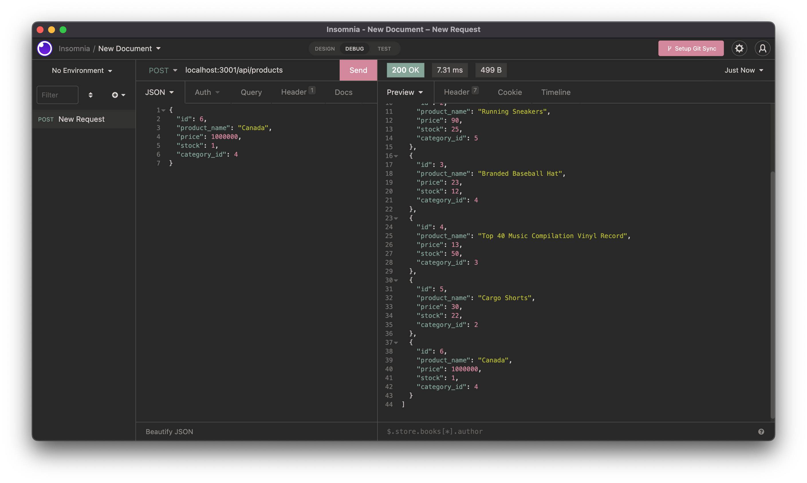
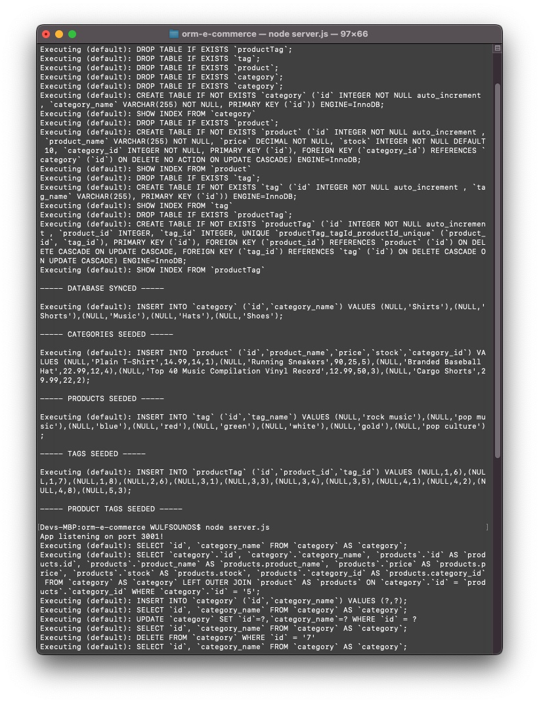

# ORM: E-Commerce

[](https://opensource.org/licenses/MIT)

## Description

This e-commerce application utilizes a mySQL database with JavaScript using Object-Relational Mapping (ORM). It highlights the ability to create, read, update, and delete data without the need to access mySQL directly. In this example, we will be using Sequelize; a program that allows us to communicate with databases using Node.js.

## Table of Contents

-   [Installation](#installation)
-   [Usage](#usage)
-   [Contributions](#contributions)
-   [Technology](#technology)
-   [License](#license)
-   [Questions](#questions)

## Installation

To get started, fork this repo into a text editor, then install the node package into your repo using in the command line.

```bash
npm install
```

Once completed, open the JavaScript file titled `server.js` in the command line by right-clilcking and selecting '*Open in Integrated Terminal*' and enter the following:

Run seed first to implement data into the database..

```bash
node run seed
```
Run the server file using node..

```bash
node server.js
```

Then open up an API tester like Insomnia or Postman and enter the local host url.

Example:

```
https://localhost:(PORT)/api/(:id)
```

For this application /api/products, /categories, and /tags will be used. Be sure to check the demo video and screen shot below.

Happy Coding!

## Usage

[View Demo using Goodle Drive](https://drive.google.com/file/d/1KStE1YvkotVc0fMLpXdiymXclC8HiVv_/view)






## Technology

Made using mySQL, Node.js, Insomnia, Sequelize, Nodemon

## License

MIT License

Copyright (c) 2022 Dev Wulf

Permission is hereby granted, free of charge, to any person obtaining a copy
of this software and associated documentation files (the "Software"), to deal
in the Software without restriction, including without limitation the rights
to use, copy, modify, merge, publish, distribute, sublicense, and/or sell
copies of the Software, and to permit persons to whom the Software is
furnished to do so, subject to the following conditions:

The above copyright notice and this permission notice shall be included in all
copies or substantial portions of the Software.

THE SOFTWARE IS PROVIDED "AS IS", WITHOUT WARRANTY OF ANY KIND, EXPRESS OR
IMPLIED, INCLUDING BUT NOT LIMITED TO THE WARRANTIES OF MERCHANTABILITY,
FITNESS FOR A PARTICULAR PURPOSE AND NONINFRINGEMENT. IN NO EVENT SHALL THE
AUTHORS OR COPYRIGHT HOLDERS BE LIABLE FOR ANY CLAIM, DAMAGES OR OTHER
LIABILITY, WHETHER IN AN ACTION OF CONTRACT, TORT OR OTHERWISE, ARISING FROM,
OUT OF OR IN CONNECTION WITH THE SOFTWARE OR THE USE OR OTHER DEALINGS IN THE
SOFTWARE.


## Questions

For questions, contact me via <a href="mailto: devinlwulf@gmail.com">email</a>.

Find me on <a href="https://github.com/wulfsounds">Github</a>.
